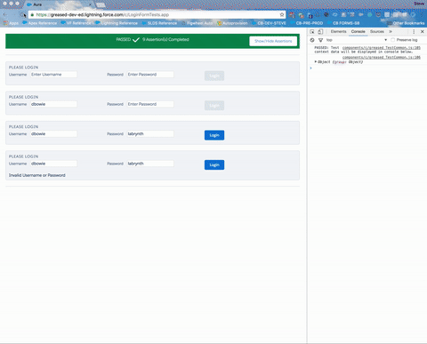

# Greased Development
End to End testing for Lightning Components

Eventually Salesforce will provide a test framework for Lightning. Until then, use Greased.

It's basically a Selenium test written in Lightning flavoured javascript. 
By testing this way, you can use the test during development to decrease your time to feedback.

## Benefits

Testing components using this technique provides two benefits:

* Normal testing, assertions and regression protection
* Faster development feedback by viewing N copies of your component in different states at the same time

## Install

Production

Sandbox

then change your browser uri to:

* /c/LoginFormTests.app : a sample test for a sample login component
* /c/greased_TestStatusTests.app : tests for the components that make up the tool

The best way to learn how to use the tool is to [look at the sample app test](https://github.com/stevebuik/greased/blob/master/src/aura/LoginFormTests/LoginFormTestsController.js). 
The comments there should be clear but please log an issue if something is not clear and I'll fix it.

## TODO

* forked chains example i.e. parallel testing of N components
* better diff display for assertEquals component
* custom logger with control toggles switched on from the url/attribute and links
* non-supported browser thenable support
* SauceLabs/Selenium script to run a test
* ANT htmlunit task to invoke from CI
